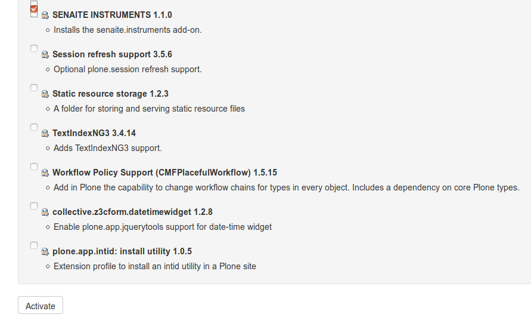

*Instrument results import and export add-on for SENAITE*
=========================================================

.. image:: https://img.shields.io/github/issues-pr/senaite/senaite.instruments.svg?style=flat-square
   :target: https://github.com/senaite/senaite.instruments/pulls

.. image:: https://img.shields.io/github/issues/senaite/senaite.instruments.svg?style=flat-square
   :target: https://github.com/senaite/senaite.instruments/issues

.. image:: https://img.shields.io/badge/README-GitHub-blue.svg?style=flat-square
   :target: https://github.com/senaite/senaite.instruments#readme

Introduction
============

SENAITE INSTRUMENTS adds **instrument results import and export**
capabilities to `SENAITE LIMS <https://www.senaite.com>`_.

Installation
============

To install SENAITE INSTRUMENTS, you have to add `senaite.instruments` to the `eggs` list inside the `[buildout]`
section of your `buildout.cfg`::

   [buildout]
   ...
   eggs =
       ...
       senaite.instruments

**Important**

For the changes to take effect you need to re-run buildout from your console::

   bin/buildout

Activate the Add-on
-------------------

Please browse to the *Add-ons* Controlpanel and activate the **SENAITE INSTRUMENTS** Add-on:

Requirements
------------

The following versions are required for SENAITE INSTRUMENTS:

-  `PLONE 5 <https://docs.plone.org/manage/installing/installation.html>`_
-  `SENAITE LIMS >= 2.0.0 <https://github.com/senaite/senaite.lims>`_

Please follow their respective installation instructions.

Development
===========

Environment
-----------

First install `buildout.coredev <https://github.com/senaite/buildout.coredev>`_.

Then clone `senaite.instruments` repository::

  cd buildout.coredev/src
  git clone https://github.com/senaite/senaite.instruments

Finally, edit `buildout.cfg`, like this::

  [buildout]
  ...
  parts =
      ...
      test

  eggs =
      ...
      senaite.instruments

  [sources]
  ...
  senaite.instruments = git https://github.com/senaite/senaite.instruments.git

  [test]
  recipe = zc.recipe.testrunner
  eggs =
      senaite.instruments [test]
  defaults = ['--auto-color', '--auto-progress']

Running tests
-------------

When above [test] part is configured you can run all tests like this::

    bin/test -s senaite.instruments

Contribute
==========

We want contributing to SENAITE.INSTRUMENTS to be fun, enjoyable, and educational
for anyone, and everyone. This project adheres to the `Contributor Covenant
<https://github.com/senaite/senaite.instruments/blob/master/CODE_OF_CONDUCT.md>`_.

By participating, you are expected to uphold this code. Please report
unacceptable behavior.

Contributions go far beyond pull requests and commits. Although we love giving
you the opportunity to put your stamp on SENAITE.INSTRUMENTS, we also are thrilled
to receive a variety of other contributions.

Please, read `Contributing to senaite.instruments document
<https://github.com/senaite/senaite.instruments/blob/master/CONTRIBUTING.md>`_.

Feedback and support
====================

* `Community site <https://community.senaite.org/>`_
* `Gitter channel <https://gitter.im/senaite/Lobby>`_
* `Users list <https://sourceforge.net/projects/senaite/lists/senaite-users>`_

License
=======

**SENAITE.INSTRUMENTS** Copyright (C) 2019 Senaite Foundation

This program is free software; you can redistribute it and/or modify it under
the terms of the `GNU General Public License version 2
<https://github.com/senaite/senaite.instruments/blob/master/LICENSE>`_ as published
by the Free Software Foundation.

This program is distributed in the hope that it will be useful,
but WITHOUT ANY WARRANTY; without even the implied warranty of
MERCHANTABILITY or FITNESS FOR A PARTICULAR PURPOSE. See the
GNU General Public License for more details.
